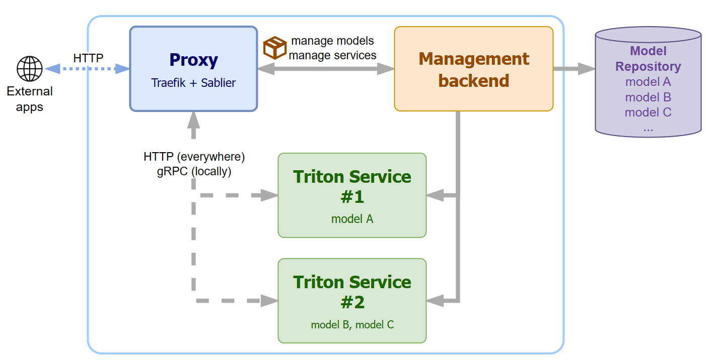

# Triton Serve
A simple deployment framework based on [NVIDIA Triton Inference Server](https://github.com/triton-inference-server/server).

## Features

This framework is meant to satisfy the following requirements:
- **Ease of use** - The framework simplifies the deployment process by handling the Docker containers itself, abstracting away the deployment issue.
- **Containers on demand** - Triton containers can automatically start and stop thanks to Traefik's Sablier plugin, to save resources when possible.
- **Robustness** - Models are deployed using a vanilla NVIDIA Triton Inference Server, offering a powerful and feature-rich platform for every necessity. 

## Concept



The architecture of Triton Serve is quite straightforward: the overall system is composed of a single management backend, a single reverse proxy/load balancer, and a variable number of Triton container instances.

### Management Backend

The backend represents the main entry point of the tool. This service provides standard a REST API with operations such as:

- CRUD endpoints to manage models (upload, update, delete models and so on)
- CRUD endpoints to manage services (create, update, delete Triton services)

This service aims to simplify the model deployment phase for every user, even without prior knowledge about Docker or best practices for model deployment in general.
The backend internally handles that part by taking the list of models to deploy, and by doing the necessary actions to make them available through an NVIDIA Triton Inference Server instance.

### Proxy

The "proxy" actually provides several features: 
- it acts as the main (and only) entry point for every service in the framework
- it automatically registers the Triton services under a subpath dynamically
- it handles the on-demand provision of these services, using [Sablier](https://github.com/acouvreur/sablier).

### Triton services

In practice, Triton services are nothing more than a vanilla Triton container, programmatically launched and managed by the backend service. These containers are launched in explicit mode so that only the required list of models is loaded on startup.

## Installation

The framework uses `docker-compose`, and it can be run through the provided makefile with a few commands.

```console
$ make run TARGET=dev|prod
```


## Development

The main bulk of code is Python-based: the development only requires a working Python environment. The following commands provide an example of development installation.

```bash
$ git clone https://github.com/links-ads/triton-serve
$ cd triton-serve
$ python -m venv .venv
$ source .venv/bin/activate  # On Windows, use .venv\Scripts\activate
$ pip install -e .[dev,test,docs]
```
