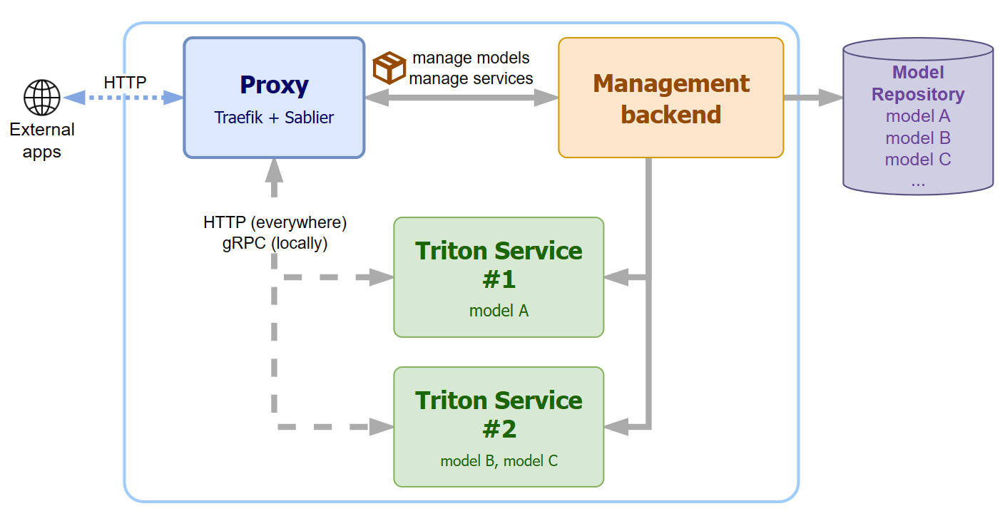

# Triton Serve

A deployment framework built on [NVIDIA Triton Inference Server](https://github.com/triton-inference-server/server).
You upload a model bundle and declare a service; the platform builds the runtime image, starts the
container, routes traffic to it, and stops it again when it goes idle.



## The pieces

- **Backend** — a FastAPI service holding the desired state of every model and service. It is a
  declarative store: creating a service writes a record and returns, it does not touch Docker.
- **Reconciler** — a Celery worker that ticks on a fixed interval, compares what Docker is actually
  doing against those records, and takes the one action that closes the gap.
- **Builder** — a separate Celery worker that builds and pushes runtime images.
- **Proxy** — Traefik, the single entry point. It authenticates the request, asks the backend
  whether the target service is ready, and forwards only if it is.
- **Triton services** — vanilla Triton containers, launched in explicit mode so each one loads only
  the models it was asked for.

## Service lifecycle

Two separate ideas, deliberately kept apart:

**Desired state** is operator intent, and only changes when someone asks for it.

| State | Meaning |
| --- | --- |
| `available` | Serve it. May scale to zero when idle, and wakes on the next request. |
| `suspended` | Forced off. No automatic wake. |
| `retired` | Deleted. Routing removed and capacity released. |

**Runtime status** is the reconciler's projection of what is actually true — `ready`, `warming`,
`idle`, `recovering`, `failed`, `suspended`, `retired`. Nothing sets it by hand; each tick observes
the container, decides, acts, and records the result.

A service under `available` scales to zero once it has seen no traffic for its inactivity timeout.
The next request arrives at the proxy, which asks the backend for the service's status; that request
records the wake and returns a retry, and the reconciler brings the container back on its next tick.
Crashes are retried against a bounded budget with exponential backoff — once spent, the service is
`failed` and stays there until an operator retries it explicitly.

## Runtime images

A service's image is content-addressed. The platform takes the base image plus the union of the
pip and system dependencies declared by the models the service serves, hashes that spec, and uses
the hash as the image tag. Two services with identical dependencies resolve to the same image and
build once; changing a model's dependencies changes the hash, so the affected services repoint to a
new image and rebuild. A service whose models declare no dependencies needs no build at all and
runs the base image directly.

## Running it

The stack runs through Docker Compose, driven by the Makefile:

```console
make run TARGET=dev|prod [ARGS="-d --build"]
```

Add `PROFILE=cpu` to run without GPUs:

```console
make run TARGET=dev PROFILE=cpu
```

## API reference

The backend serves its own interactive OpenAPI documentation. Behind the proxy it lives at
`/api/docs`, covering model upload and management, service creation and updates, API key
administration, and the resource allocation overview.

## Development

Dependencies are managed with [uv](https://docs.astral.sh/uv/):

```console
git clone https://github.com/links-ads/triton-serve
cd triton-serve
make install
```

`make lint`, `make typecheck` and `make test` are the gates; the test suite runs against a
containerised stack rather than in-process.
